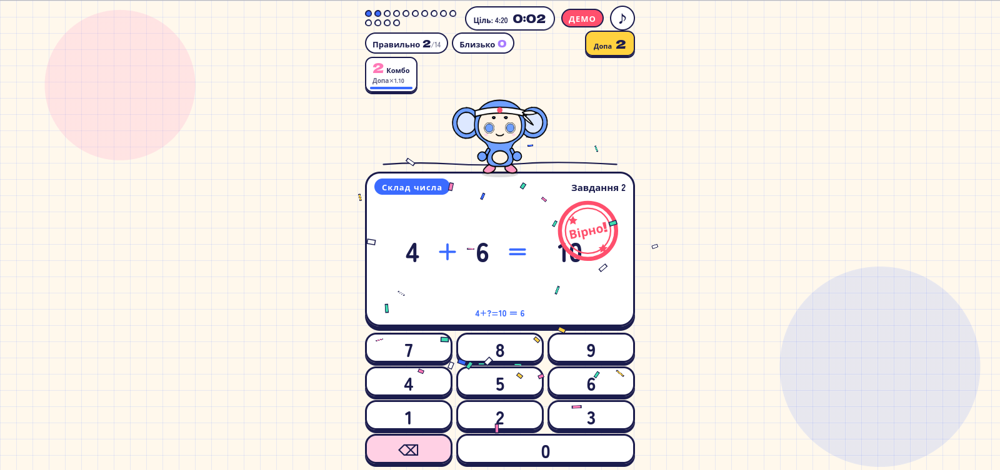

# Dopa Drill Enhanced

[](https://dopa-drill.ivansvarkovsky.workers.dev)
[](https://dopa-drill.ivansvarkovsky.workers.dev)
[](https://github.com/grmchn/dopa-drill)
[](LICENSE)

<p align="center">
  
</p>

> Live Web Demo: [https://dopa-drill.ivansvarkovsky.workers.dev](https://dopa-drill.ivansvarkovsky.workers.dev)  
> Repository: [https://github.com/Svarkovsky/dopa-drill-ukr](https://github.com/Svarkovsky/dopa-drill-ukr)  
> Original upstream project: [grmchn/dopa-drill](https://github.com/grmchn/dopa-drill) by [@grmchn4ai](https://github.com/grmchn4ai)

---

## Українська (Ukrainian)

### Огляд проекту
Dopa Drill Enhanced - це неофіційний, оптимізований та розширений некомерційний форк оригінальної японської гри-тренажера усного рахунку Dopakichi Dopadoril (автор: @grmchn4ai).

У цьому форку збережено візуальний коміксно-паперовий стиль, ритм і динаміку оригінальної гри, але проведена масштабна оптимізація: додано повну українську локалізацію, додано розділ для дошкільнят (Grade 0+), перероблено звуковий та графічний рушії, усунено затримки на слабкому залізі та забезпечено підтримку повноцінного офлайн-режиму (PWA).

### Порівняння: Оригінал (grmchn) проти Enhanced Fork

| Модуль / Функція | Оригінал (grmchn) | Dopa Drill Enhanced (Наш форк) |
| :--- | :--- | :--- |
| Мови інтерфейсу | Японська, частково Англійська | Українська (100% покриття), Англійська (за замовчуванням), Японська |
| Вікові категорії | 1-6 класи (Grade 1-6) | 0+ (Дошкільнята / Grade 0) + 1-6 класи |
| Синтез звуку (Web Audio) | Процедурний синтез кожного звуку в реальному часі (до 18 осциляторів на дзвінок/хор) | Pre-rendering (Baking) у фоні через OfflineAudioContext: хор, дзвіночки, ударні грають із буфера з апаратним пітч-шифтом (навантаження звуку на CPU нижче на 80%) |
| Стерео-реверберація | Важка стерео-імпульсна згортка 2.4с | Легкий моно-імпульс 1.0с (у 5 разів менше навантаження на FFT-згортку) |
| Планувальник звуку | Викликався у requestAnimationFrame (при просіданні FPS звук клацав) | Незалежний 25мс таймер: безперервне опереджальне наповнення аудіобуфера, звук не заїкається навіть при важких анімаціях |
| Роздільна здатність Canvas | Сирий devicePixelRatio (на 4K/Retina створював полотна по 8-10 млн пікселів) | Адаптивний бюджет пікселів (getAdaptiveDPR): ліміт 1080p, зменшення площі рендерингу на Retina в 4-6 разів без втрати чіткості |
| Частинки (Confetti / FX) | Створення та видалення десятків JS-об'єктів кожен кадр через filter() | Пул об'єктів частинок та in-place компактизація масиву: нульове навантаження на Garbage Collector (GC), піковий лаг скорочено з 34 мс до 17 мс |
| DOM Layout Thrashing | Виклики getBoundingClientRect() кожен кадр усередині анімаційного циклу | Покадрове кэшування centerOf() через WeakMap: відсутність примусових перерахунків геометрії браузером (Forced Reflow) |
| Режими заліза | Фіксований єдиний рендер (гальмував без GPU / на софтверному WebGL) | Перемикач Auto / High / Low: у режимі Low важкий шейдер відключається, conic-градиент і hue-rotate замінено на легкий linear-gradient, розмиття замінено на чіткі контури (стабільні 60 FPS на одному ядрі CPU) |
| Вкладки колекції | Горизонтальний скрол без видимої смуги прокрутки (не крутився колесом миші на ПК) | Повний скрол колесом миші, перетягування (Drag-to-scroll), акуратний скролбар 6px, плавне центрування обраної вкладки |
| Підтримка PWA | Відсутня | Service Worker (v1.0.10) із кешуванням та повноцінним офлайн-доступом, банер та інструкції з встановлення |
| Хмарний деплой | Тільки локальний запуск | Автоматична збірка та миттєвий деплой на Cloudflare Workers Edge |
| Донат та підтримка | Стандартні посилання | Анімована чашка кави в шапці з переходом на персональну сторінку автора |

### Правила некомерційних фан-робіт (Fan-Work Policy)
Цей проект створено відповідно до політики використання персонажа Dopakichi та гри Dopadoril:
- Неофіційний статус: цей проект є незалежною некомерційною модифікацією і не позиціонується як офіційний реліз.
- Вільне використання: створення фан-арту, відеороликів, стрімів та некомерційних форків дозволено.
- Комерційне використання заборонено: продаж товарів, брендування або використання у платних сервісах без попереднього дозволу правовласника заборонені.

---

## English

### Project Overview
Dopa Drill Enhanced is an unofficial, high-performance, non-commercial fork of the original Japanese mental arithmetic arcade game Dopakichi Dopadoril, originally created by @grmchn4ai.

While staying true to the cartoon paper-craft visuals, punchy rhythm beats, and dopamine-driven learning loops, this fork introduces massive architectural overhauls: full Ukrainian localization, preschool Grade 0+ foundations, offline PWA capabilities, and extensive CPU/GPU performance optimizations.

### Key Improvements Over Upstream

1. Full Ukrainian & Trilingual Localization:
   - 100% translation across all menus, arithmetic vertical step hints, daily quests, trophies, help dialogs, and titles.
   - Dynamic step explanation parsing and localized arithmetic layouts.
2. Preschool Mode (Grade 0+):
   - 6 foundational math skills tailored for early learners (Next +1, Previous -1, Number 5 composition, Addition/Subtraction up to 5, Zero properties).
3. Web Audio Baking & Scheduler Decoupling:
   - Pre-rendered synths using OfflineAudioContext for choir, bells, and drum hits, pitch-shifted via hardware playbackRate with near-zero CPU overhead.
   - 1.0s mono convolver impulse response replacing heavy 2.4s stereo convolution (~5x lighter FFT compute).
   - Dedicated 25ms timer audio scheduler ensuring continuous lookahead buffer feeding, eliminating audio crackles during frame drops.
4. Rendering & Particle Pipeline Optimizations:
   - Pixel Budgeting (Adaptive DPR): Caps resolution at 1080p, preventing massive 8-10M pixel canvas allocations on 4K/Retina displays.
   - Particle Pool & In-place Compaction: Zero array allocations during celebration bursts and confetti explosions; drops GC spikes by ~95%.
   - WeakMap Frame Caching for centerOf(): Completely eliminates layout thrashing caused by repeated getBoundingClientRect() calls.
5. Hardware Performance Modes (Auto / High / Low):
   - Interactive 3-way toggle directly in Settings.
   - Low mode stops CPU-side software WebGL shaders, replaces conic-gradient and hue-rotate with ultra-lightweight linear gradients, removes 40px Gaussian blurs, and substitutes screen shake with an outline impulse for butter-smooth 60 FPS on any CPU.
6. Progressive Web App (PWA) & Edge Deployment:
   - Service Worker caching (v1.0.10) for 100% offline play.
   - Edge worker bundling toolchain deployed to Cloudflare Workers.

### Unofficial Fan-Work Guidelines
In accordance with the original creator's guidelines:
- Unofficial Notice: This project is an unofficial fan adaptation.
- Non-Commercial Use: You are free to create fan art, gameplay videos, live streams, and non-commercial forks.
- Commercial Restrictions: Merchandise sales, inclusion in paid services, or claiming official endorsement requires prior authorization.

---

## 日本語 (Japanese)

### プロジェクト概要
Dopa Drill Enhanced（ドパドリル機能拡張版）は、@grmchn4ai 氏によって制作された算数ドリルゲーム「ドパキチのドパドリル」の非公式・非営利パフォーマンス最適化フォークです。

オリジナルの親しみやすい紙細工風のグラフィック、爽快なビート、達成感を引き出す学習体験をそのままに、ウクライナ語ローカライズ、幼児向けグレード0+の追加、Web Audioの事前レンダリング（Baking）、低スペックPC向けのハードウェア適応モード、PWAオフライン対応などを実装しました。

### 主な拡張機能と最適化

1. 多言語およびウクライナ語の完全対応:
   - UI全体、筆算の手順ガイド、デイリークエスト、トロフィー、ヘルプをウクライナ語に完全翻訳（英語・日本語との3言語対応）。
2. 幼児・未就学児向け「0+」グレードの追加:
   - 数の順序（+1 / -1）、5の合成、5までの加減算、0の計算など6つの基礎スキルを追加。
3. Web Audioエンジンの軽量化とBaking処理:
   - OfflineAudioContext を活用し、負荷の高いコーラス、ベル、ドラム音を起動時に事前レンダリング。再生時はピッチ変更（playbackRate）のみで動作し、CPU負荷を大幅削減。
   - レンダリングフレームレートの低下に影響されない独立25ms音声スケジューラを導入し、音飛びを完全に解消。
4. 描画負荷の低減とGC（ガベージコレクション）の撲滅:
   - 高解像度ディスプレイにおける描画負荷を制限する「アダプティブDPR（Pixel Budgeting）」を実装。
   - パーティクルオブジェクトのプーリングと配列のインプレース圧縮により、紙吹雪や花火演出時のGCフリーズを95%削減。
   - getBoundingClientRect() のフレーム内キャッシュにより、レイアウトスラッシング（Forced Reflow）を根絶。
5. グラフィックモード設定（Auto / High / Low）:
   - 設定画面でワンタップ切り替え可能な描画モードを搭載。「Low」モードではソフトウェアWebGLや重いグラデーション計算を回避し、GPU非搭載のPCでも安定した60FPSを実現。
6. PWA完全対応 & Cloudflare Workersデプロイ:
   - Service Workerによるオフラインキャッシュと自動更新に対応。

### 二次創作ガイドラインの遵守について
本プロジェクトは、原作者様が定める「ドパキチのドパドリル 二次創作ガイドライン」に基づいて公開されています:
- 非公式表明: 本作品は公式の製品ではなく、ファンによる非公式の改変版です。
- 利用可能範囲: 非営利目的でのファンアート制作、実況配信、動画投稿、非営利フォークの公開が許可されています。
- 事前許諾が必要な事項: グッズ販売や有料サービスへの組み込み、公式と誤認させる利用は禁止されています。

---

## ローカル開発 / Local Development

```bash
# Python
python3 -m http.server 8080 --directory app

# Node.js
npx serve app -l 8080
```

### モジュールテスト / Unit Tests
```bash
node --test tests/*.test.mjs
```

### Cloudflare Workers ビルド / Build
```bash
node build-worker.mjs
```

---

## 権利表記 / Credits

- Original Creator: @grmchn4ai (gear machine@AI)
- Original Repository: [grmchn/dopa-drill](https://github.com/grmchn/dopa-drill)
- Fork Author & Performance Lead: Svarkovsky ([Donate](https://svarkovsky.github.io/donate/))
